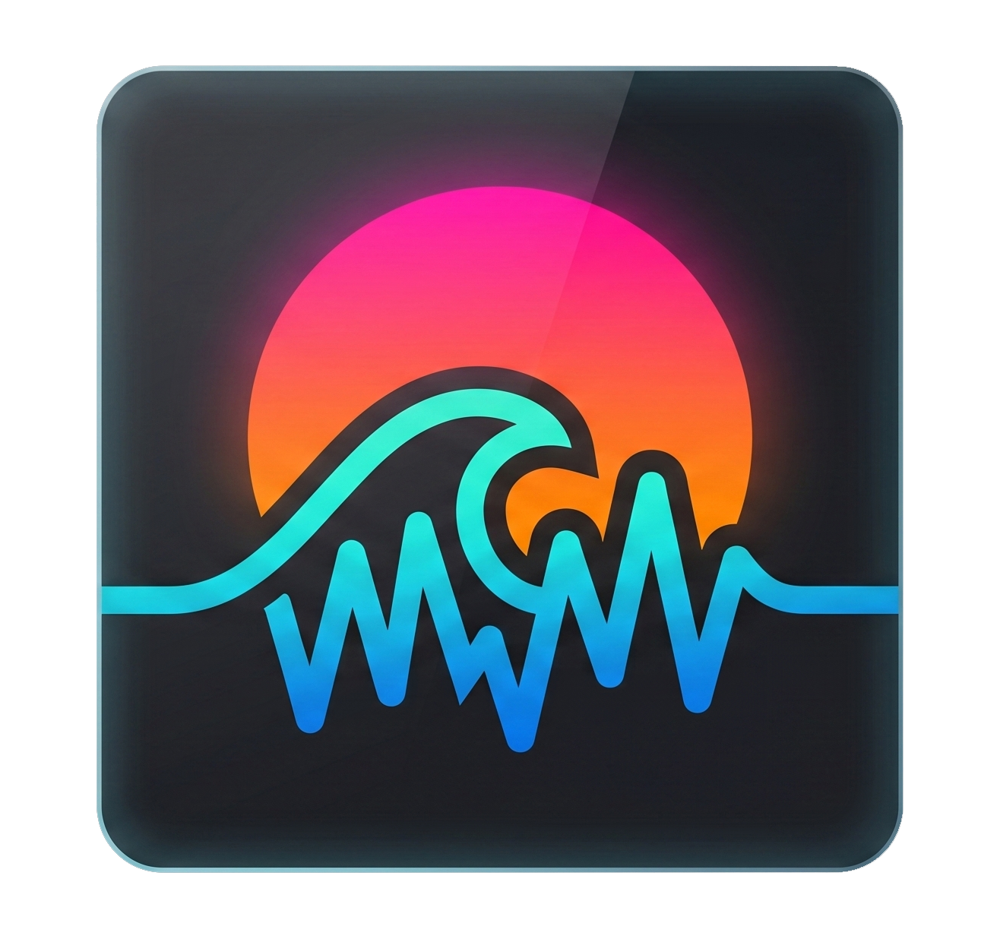

<div align="center">



# Crysta's Tide

**A living ocean that breathes with your music.**


</div>

---

## What is this?

Crysta's Tide is an audio-reactive 3D ocean visualizer. Drop any song and watch the world transform — bass swells the waves, treble ripples the surface, and the sky cycles through dawn, noon, dusk and night as the music progresses.

No bars. No circles. Just an ocean that feels alive.

> _The name is a quiet nod to a world that was once silent — and was brought back to life._

---

## Features

- **Audio-reactive ocean** — low frequencies drive massive wave swells, high frequencies create surface chop
- **Full day/night cycle** — sky, sun, clouds and water color shift in sync with song progress
- **Custom GLSL shaders** — ocean with vertex displacement and physically-based specular, sky with domain-warped FBM clouds and Beer-Lambert self-shadowing
- **Sun arc** — rises from below the horizon, peaks at midday, sets at the other side
- **Solar reflections** — specular glint on water matches the sun's actual color at each time of day
- **Zero re-renders** — audio analysis writes to a ref at 60fps, the 3D scene reads directly from it. React state only updates 4x/s for the debug overlay
- **Floating pill UI** — minimal glassmorphism player with 3D tilt effect

---

## Stack

| Layer           | Tech                                 |
| --------------- | ------------------------------------ |
| Framework       | React 19 + Vite                      |
| 3D              | Three.js + React Three Fiber         |
| Post-processing | react-postprocessing (Bloom)         |
| Shaders         | Custom GLSL (vertex + fragment)      |
| Audio           | Web Audio API — `AnalyserNode` + FFT |
| Styling         | Tailwind CSS v4                      |
| Icons           | Lucide React                         |

---

## Getting started

```bash
# Install dependencies
npm install

# Start dev server
npm run dev

# Build for production
npm run build
```

Then open `http://localhost:5173`, click the upload icon on the floating pill, and drop any audio file (`.mp3`, `.wav`, `.ogg`, `.flac`, `.aac`).

---

## How it works

### Audio pipeline

```
Audio File → AudioContext → AnalyserNode → Uint8Array (FFT)
                                ↓
                    getByteFrequencyData() @ 60fps
                                ↓
                    analysisRef.current { bass, treble, progress }
                                ↓
                    useFrame() reads ref directly → GLSL uniforms
```

Bass is averaged from bins `1–10` (~21–215 Hz). Treble from bins `100–512` (~2.1–11 kHz). Both are smoothed with asymmetric lerp — fast attack, slow decay — so the ocean reacts snappily to beats but doesn't jerk on transients.

### Sky & clouds

The sky is a fullscreen plane rendered behind everything (`depthTest: false`, `renderOrder: -1`). Clouds use **domain-warped FBM** — the input coordinates of the noise function are themselves distorted by another FBM pass, which creates the organic, non-repeating shapes. Self-shadowing is approximated via Beer-Lambert: sampling cloud density in the sun's direction and attenuating light exponentially.

### Day/night cycle

Five color keyframe arrays (sky top, sky horizon, sun color, hemisphere light sky, hemisphere light ground) are interpolated each frame using `THREE.Color.lerpColors()`. The sun elevation follows `sin(progress × π)`, starting 6° below the horizon, peaking at 22°, and setting symmetrically. `uSunGlow` is driven by `smoothstep(sunDir.y, -0.08, 0.08)`, so glow and specular fade naturally as the sun approaches the horizon.

---

## Project structure

```
src/
├── features/
│   ├── audio/
│   │   └── useAudioAnalyser.js   # Web Audio API hook — all audio logic
│   ├── player/
│   │   └── FloatingPill.jsx      # Minimal glassmorphism player UI
│   └── scene/
│       ├── OceanScene.jsx        # Three.js canvas, lighting, day cycle
│       └── shaders/
│           ├── ocean.js          # Vertex displacement + PBR specular
│           ├── sky.js            # Domain-warped clouds + sun disk
│           └── noise.js          # Simplex 3D noise (Gustavson/Ashima)
└── App.jsx
```

---

## License

<a href="LICENSE"> ⚖️ MIT </a> — do whatever you want with it, just credit me.

---

<div align="center">
  <sub>Built by <a href="https://github.com/ArkGrayer">Igor Feitosa</a> — somewhere between the ocean and the sky.</sub>
</div>
